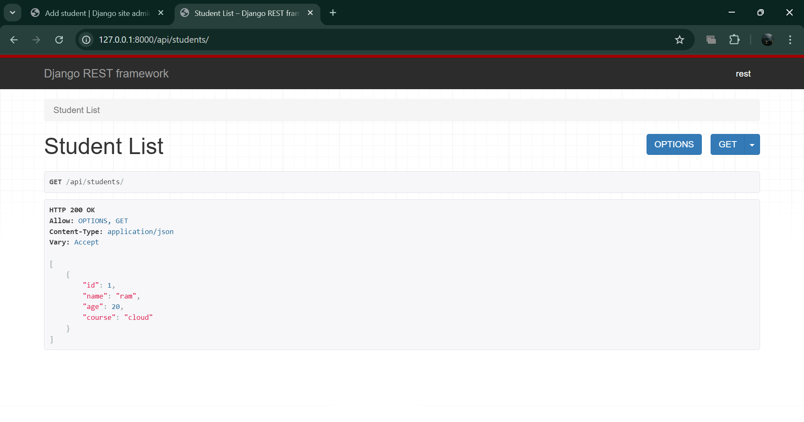
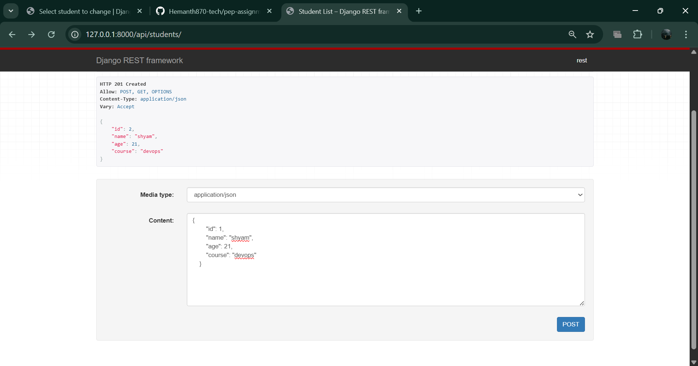
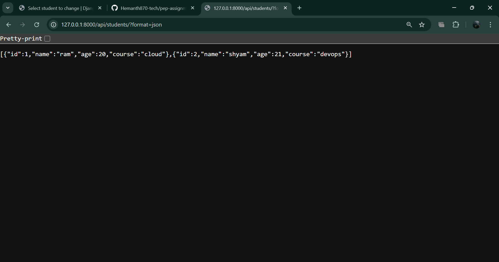
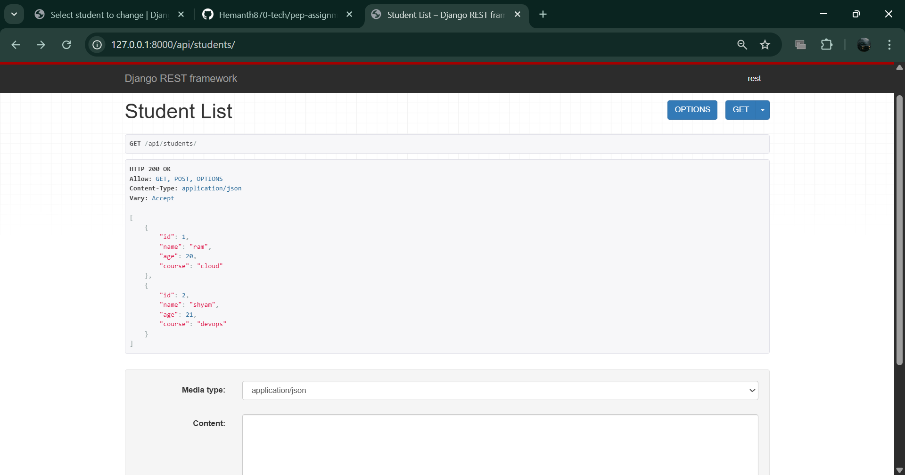
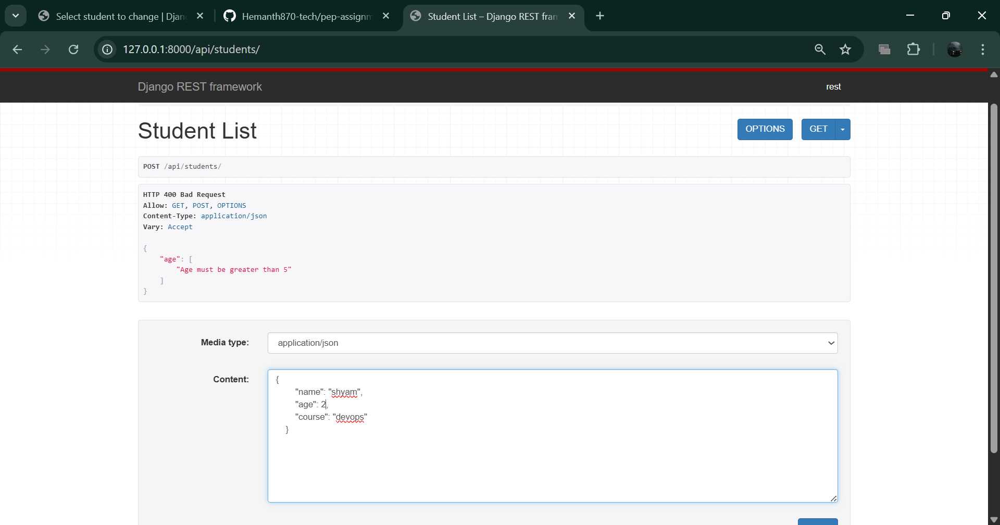

# ASSIGNMENT 1:

1. app/urls.py

urlpatterns = [
    path('students/', student_list, name='student-list'),
]

2. app/views.py

from .models import Student

@api_view(['GET'])
def student_list(request):
    students = Student.objects.all()

    data = []
    for student in students:
        data.append({
            "id": student.id,
            "name": student.name,
            "age": student.age,
            "course": student.course
        })

    return Response(data)

3. app/models.py

from django.db import models

# Create your models here.
class Student(models.Model):
    name = models.CharField(max_length=100)
    age = models.IntegerField()
    course = models.CharField(max_length=100)
    
    def __str__(self):
        return self.name

# ASSIGNMENT 2:

1. app/views.py
from rest_framework.decorators import api_view
from rest_framework.response import Response
from rest_framework import status
from .models import Student
from .serializers import StudentSerializer  

@api_view(['GET', 'POST'])
def student_list(request):

    if request.method == 'GET':
        students = Student.objects.all()
        serializer = StudentSerializer(students, many=True)  # Serialize all students
        return Response(serializer.data)  # serializer.data is already in correct format

    if request.method == 'POST':
        serializer = StudentSerializer(data=request.data)  # Pass request data to serializer
        
        if serializer.is_valid():
            serializer.save()  
            return Response(serializer.data, status=status.HTTP_201_CREATED)
        else:
            return Response(serializer.errors, status=status.HTTP_400_BAD_REQUEST)

2. app/serailzier.py

from rest_framework import serializers
from .models import Student

class StudentSerializer(serializers.ModelSerializer):
    class Meta:
        model = Student
        fields = ['id', 'name', 'age', 'course']

# ASSIGNMENT 3:

app/views.py

from rest_framework.decorators import api_view
from rest_framework.response import Response
from rest_framework import status
from .models import Student
from .serializers import StudentSerializer

@api_view(['GET', 'POST'])
def student_list(request):

    # 🔹 GET Method
    if request.method == 'GET':
        students = Student.objects.all()
        serializer = StudentSerializer(students, many=True)
        return Response(serializer.data)

    # 🔹 POST Method
    elif request.method == 'POST':
        serializer = StudentSerializer(data=request.data)

        if serializer.is_valid():
            serializer.save()
            return Response(serializer.data, status=status.HTTP_201_CREATED)

        return Response(serializer.errors, status=status.HTTP_400_BAD_REQUEST)

app/serializer.py

added one line at bottom: fields = '__all__'

# ASSIGNMENT 4:

app/serailzers.py

from rest_framework import serializers
from .models import Student

class StudentSerializer(serializers.ModelSerializer):

    class Meta:
        model = Student
        fields = '__all__'

    def validate_age(self, value):
        if value <= 5:
            raise serializers.ValidationError("Age must be greater than 5")
        return value

# ASSIGNMENT 5:

1. my-profile/polls/views.py

@csrf_exempt
def submit_contact(request):
    if request.method == 'POST':
        # Get form data
        name = request.POST.get('name')
        email = request.POST.get('email')
        message_text = request.POST.get('message')
        
        # Save to database
        contact = ContactMessage.objects.create(
            name=name,
            email=email,
            message=message_text
        )
 Hello {name},

Thank you for contacting me! I've received your message and will get back to you shortly.

Your message: "{message_text}"

Connect with me:
- Docker Hub: https://hub.docker.com/u/heamnth345 (97+ pulls! ⭐)
- GitHub: https://github.com/Hemanth870-tech
- LinkedIn: https://linkedin.com/in/hemanth-issai

Best regards,
Hemanth Issai
Cloud & DevOps Engineer
        """
        
        try:
            send_mail(
                subject=subject,
                message=plain_message,
                html_message=html_message,
                from_email=settings.DEFAULT_FROM_EMAIL,
                recipient_list=[email],
                fail_silently=False,
            )
            email_status = "sent"
        except Exception as e:
            print(f"Email error: {e}")
            email_status = "failed"
        
        # Return success response
        return JsonResponse({
            'success': True,
            'message': 'Message sent successfully! Check your email for confirmation.',
            'email_status': email_status
        })
    
    return JsonResponse({
        'success': False,
        'message': 'Invalid request'
    })

2. my-profile/settings.py

STATIC_URL = 'static/'
STATIC_ROOT = os.path.join(BASE_DIR, 'staticfiles')
EMAIL_BACKEND = 'django.core.mail.backends.smtp.EmailBackend'
EMAIL_HOST = 'smtp.gmail.com'
EMAIL_PORT = 587
EMAIL_USE_TLS = True
EMAIL_HOST_USER = '**********@gmail.com'  # Your Gmail
EMAIL_HOST_PASSWORD = '************'  # Your App Password
